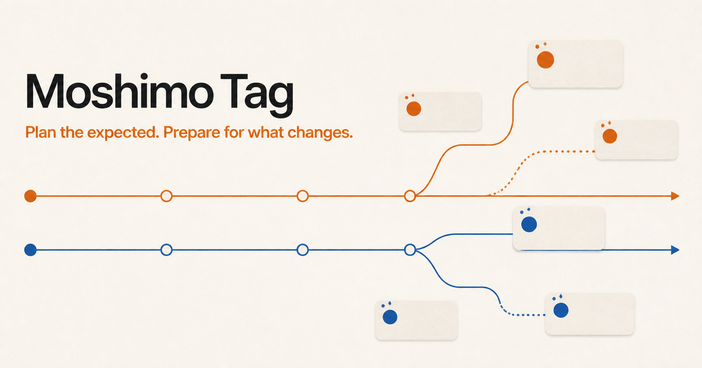

# Moshimo Tag

**Add a what-if layer to any plan.**

[Open the live app](https://moshimo-tag.kazuomi-kuguiya.chatgpt.site)



Moshimo Tag is a local-first planning workspace for the [WebMCP Challenge](https://webmcp.devpost.com/). A person creates an expected Plan, while a browser agent can attach realistic What-ifs, Cases, and concrete response candidates to the exact moments where they matter.

The agent prepares useful options. The person decides what to accept, edit, or dismiss.

## Why WebMCP

Ordinary AI risk lists are detached from the plan and disappear after the conversation. Moshimo Tag exposes the live planning model as page tools so an agent can read and update the same structured state the person sees.

This makes it possible to:

- create or open a Project without reproducing the UI through clicks;
- add ordered Plan items and anchor What-ifs to specific moments;
- add Cases and concrete response candidates;
- prepare editable Plan B options without accepting them for the person;
- preserve every human decision in the page's local state;
- read a clean final projection for a summary, spreadsheet, or runbook.

## Human decision boundary

WebMCP tools may create and edit candidate content, including Plan B option drafts. They cannot accept, dismiss, or save a human response. Every Case remains undecided until the person reviews it in the page UI.

This boundary is enforced by the shared application command path used by both the UI and WebMCP mutations.

## Try it

1. Open the [live app](https://moshimo-tag.kazuomi-kuguiya.chatgpt.site) in ChatGPT's in-app browser or a browser with WebMCP enabled.
2. Send the browser agent a request such as:

   > On this open Moshimo Tag page, use the page's Site tools (WebMCP). Create a Project for [what you are preparing; ex - baking a baguette]. Add the Plan, likely What ifs, Cases, and concrete response candidates. Leave every decision undecided for me to review.

3. Review the agent-prepared candidates in Moshimo Tag.
4. Accept, edit, choose another response, or dismiss each Case yourself.
5. Select **Save & finish** to see the final Plan and its Case-specific branches.

No sample Project is injected into the production path. A new browser starts with the onboarding screen and an empty local workspace.

## WebMCP tools

Moshimo Tag registers its tools through `document.modelContext.registerTool()` in [`src/webmcp.ts`](src/webmcp.ts).

| Tool | Purpose |
| --- | --- |
| `list_projects` | Read workspace status and saved Project summaries. |
| `get_project` | Read a bounded Project, Plan, What-if, Case, or final projection. |
| `create_project` | Create a Project with an optional atomic initial Plan bundle. |
| `open_project` | Open a locally saved Project. |
| `update_project` | Update Project title and description. |
| `set_project_view` | Switch between editing and final view. |
| `edit_plan` | Add, update, move, or delete one Plan item. |
| `edit_what_if` | Add, update, delete, rank, or sort What-ifs. |
| `edit_case` | Add, update, or delete a Case and its candidates. |
| `edit_plan_b_options` | Create or edit unsaved Plan B options for any Case. |
| `get_export_projection` | Read structured human-summary, timeline, Case-matrix, or runbook output. |

All mutation tools validate IDs, entity versions, operation bounds, and idempotency keys before they use the shared dispatcher. Read tools expose bounded projections rather than raw browser storage.

## Local development

Requirements:

- Node.js 22.13 or newer
- npm
- a WebMCP-capable browser for agent-tool testing

Install and start the app:

```bash
npm install
npm run dev
```

Open `http://localhost:3000`.

Run the verification suite:

```bash
npm run test:state
npm run lint
npx tsc --noEmit
npm run build
```

The app does not require an API key or backend. Project data is stored in browser `localStorage`. Environment-specific values belong in an ignored `.env` file; [`.env.example`](.env.example) contains the safe public template.

## Project structure

- [`app/page.tsx`](app/page.tsx) — product UI and WebMCP registration lifecycle
- [`src/app-state.ts`](src/app-state.ts) — validated state, commands, persistence, undo, and redo
- [`src/webmcp.ts`](src/webmcp.ts) — WebMCP schemas, reads, mutations, and tool registration
- [`src/*.test.ts`](src) — state, persistence, human-decision, stale-data, and WebMCP contract tests
- [`public/`](public) — icons, onboarding images, and public assets

## License

Released under the [MIT License](LICENSE).
