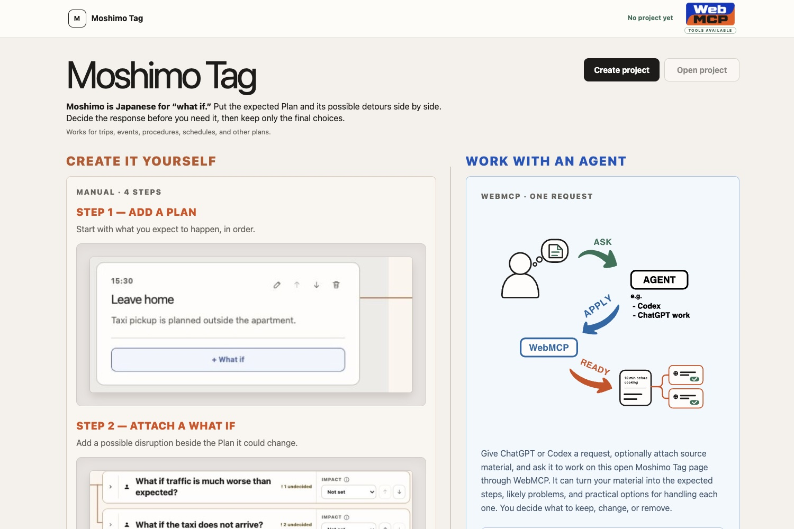

# Moshimo Tag

**Add a what-if layer to any plan.**

[Open the Live App](https://moshimo-tag.kazuomi-kuguiya.chatgpt.site)

[Watch the Demo Video](https://youtu.be/-mxwOIAZnxs)



“Moshimo” is a Japanese word that roughly means “what if.”

Moshimo Tag is a local-first, WebMCP-enabled planning workspace for attaching possible What ifs to a Plan—such as a schedule, procedure, or script—and organizing concrete Situations, main countermeasures, and Plan B countermeasures beneath them.

You can build a plan manually or ask a browser agent through WebMCP to handle the planning work that tends to become tedious. The agent only prepares candidates, however. A human makes the final decision about which countermeasures to adopt, edit, prepare, or dismiss.

---

## What You Can Do

Users create a Project and arrange schedules, procedures, scripts, or other steps as Plan items in chronological or execution order.

```text
Project: Flight to San Francisco.

Plan 1: Research airlines.
Plan 2: Book a seat.
Plan 3: Leave home.
Plan 4: ...
```

Each Plan item can have the following structure:

```text
Plan item
└─ What-if
   ├─ Situation 1
   │  ├─ main countermeasure
   │  ├─ Plan B 1 countermeasure
   │  ├─ Plan B 2 countermeasure
   │  └─ ...
   └─ Situation 2
      ├─ main countermeasure
      └─ ...
```

For example, you can attach the What-if “What if I leave late?” to the Plan item “Leave for the venue.” Beneath it, you can separate Situations such as “15 minutes late” and “more than 30 minutes late,” then prepare a main countermeasure and any necessary Plan B countermeasures for each one.

Everything can be entered manually. When asked, a WebMCP-capable agent can read the current Project and perform the following actions on the same page:

- Create, update, and switch Projects
- Add, edit, reorder, and delete Plan items
- Add and edit What-ifs and their impact
- Add and edit Situations and main countermeasures
- Add, edit, and delete Plan B countermeasures
- Prepare response candidates for human review
- Read final-state projections for summaries, spreadsheets, Situation matrices, and runbooks

After a human reviews each item, opening `View final plan` removes the noise from candidates and undecided items, showing only the selected countermeasures together with the original Plan.

### Terminology

#### Situation

The concrete state or outcome through which a What-if may materialize. The name `Case` remains in saved data and the WebMCP API for compatibility.

#### Response candidate

A nonbinding draft for `Already covered`, `Accept risk`, or `Prepare` that WebMCP can prepare. It is stored separately from the human response.

#### Human response

The final decision a human selects for each countermeasure, edits if necessary, and saves. `Prepare` records the preparation needed to make that countermeasure executable; it is not the fallback itself.

---

## Why WebMCP

Even without WebMCP, you can ask AI to “list the risks” and get What-ifs for a plan. General chat responses, however, tend to become longer lists than necessary, while the following information does not remain as persistent state:

- Which Plan item each What-if relates to
- Which countermeasure the human adopted

Moshimo Tag moves the AI response out of the chat and attaches it directly to the same Plan the human is viewing.

A browser agent reads the structured Project state on the open page and uses stable IDs—not guessed DOM positions—to add What-ifs and countermeasures at the exact points they affect. This greatly reduces the chance of using the wrong input field or pressing a button at the wrong time.

The agent's work becomes a direct, visible, and verifiable change to the same page, the same Project, and the same saved state. Humans do not need to synchronize separate copies or chat logs manually, and the plan structure in the app remains consistent even when the format of the AI output changes from one request to the next.

WebMCP also lets an application deliberately limit an agent's authority. Moshimo Tag leaves final decisions to humans through the way its WebMCP tools are implemented, not merely through a promise in a system prompt.

---

## Human Decision Boundary

WebMCP tools can create and edit the following candidate content:

- Plan items
- What-ifs and impact
- Situations
- Main countermeasures
- Plan B countermeasures
- Response candidates for `Already covered`, `Accept risk`, and `Prepare`

Valid changes made by an agent appear on the same page as soon as they are saved. However, WebMCP tools cannot select or save the following human decisions:

- **Already covered**
- **Accept risk**
- **Prepare**
- **Dismiss**

The main countermeasure and each Plan B countermeasure in a Situation have independent responses. Each countermeasure remains undecided until a human reviews it on the page, edits the wording if necessary, and saves their own response.

A response candidate can serve as a draft in the human editor, but it does not automatically finalize a human response. If WebMCP adds a candidate later, it does not change any human response that has already been saved.

This boundary is implemented through the validated application command path shared by UI and WebMCP mutations, and through human-only response commands that are not exposed to WebMCP.

---

## Try It

No login, credentials, or API key are required. Project data you create is saved to the browser's `localStorage`.

1. Open the [Live App](https://moshimo-tag.kazuomi-kuguiya.chatgpt.site) in the ChatGPT desktop app's in-app browser (recommended), or in Chrome with WebMCP enabled (see the [Chrome WebMCP documentation](https://developer.chrome.com/docs/ai/webmcp?hl=en)).
2. Confirm that `TOOLS AVAILABLE` appears in the upper-right corner.
3. Send the following sample prompt to the browser agent.

```text
On this open Moshimo Tag page, use WebMCP to create a Project for hosting a barbecue. Add the expected Plan, likely What ifs, Situations, main countermeasures, and useful Plan B countermeasures. Unless I name other people, write every action for the Project owner to carry out alone. Leave every decision undecided for me to review.
```

4. Review the Project, chronological Plan, What-ifs, Situations, main countermeasures, and Plan B countermeasures the agent adds to the same page.
5. Open a Situation and edit each countermeasure if necessary.
6. Select **Already covered**, **Accept risk**, **Prepare**, or **Dismiss** yourself, then save the response.
7. Open **View final plan** and review only the selected countermeasures for each Situation together with the original Plan.

This flow was verified in ChatGPT’s in-app browser with Codex.

You can also create Projects and Plans manually, then ask the agent to edit only a specific Plan item, What-if, Situation, or countermeasure. Manual editing through the human UI remains available in environments without WebMCP.

---

## WebMCP Tools

Moshimo Tag registers 12 page tools with `document.modelContext.registerTool()` in [`src/webmcp.ts`](src/webmcp.ts).

| Tool | Purpose |
|---|---|
| `list_projects` | Read workspace status and saved Project summaries |
| `get_project` | Read a Project, its Plan, What-ifs, Situations, human responses, and final projection |
| `create_project` | Create a Project, optionally with an atomic initial Plan bundle |
| `open_project` | Open a locally saved Project |
| `update_project` | Update the current Project's title and description |
| `set_project_view` | Switch between editing and final views |
| `edit_plan` | Add, update, move, and delete Plan items |
| `edit_what_if` | Add, update, and delete What-ifs, set impact, and sort What-ifs by impact |
| `edit_case` | Add, update, and delete Situations and main countermeasures |
| `edit_plan_b_options` | Add, replace, edit, and delete Plan B countermeasures for a Situation |
| `edit_response_candidates` | Add, update, and delete nonbinding response candidates for a Main or Plan B countermeasure |
| `get_export_projection` | Read human-summary, timeline, Situation-matrix, and runbook projections |

Compatibility notes:

- For backward compatibility, some WebMCP fields still use `case` where the UI uses `Situation`.

Every mutation tool validates the following before using the shared dispatcher:

- Object IDs
- Project and entity versions
- Strict input shapes
- Text and collection bounds
- Valid operations and states
- Idempotency keys

Read tools do not expose raw browser storage. They return bounded projections for specific purposes.

---

## Local-first Architecture, Safety, and Privacy

- Project data is stored in the current browser profile as one versioned `localStorage` state.
- The app uses no account, login, cloud sync, dedicated backend, or app-owned AI API.
- The human UI and WebMCP mutations use the same validated application command path and persistence path.
- User content, agent input, and saved data are treated as untrusted until validated at the boundary.
- User or agent text is never executed as HTML or commands.
- Unknown IDs, stale entity versions, invalid states, limit violations, and duplicate mutations are rejected.
- If persistence fails, the previous valid state is preserved and the operation is not treated as successful.
- WebMCP cannot set or overwrite human-saved responses or preparation status.
- Read tools return only the required projections and do not expose raw storage.
- Project content is not stored on a dedicated Moshimo Tag server.
- AI suggestions are not presented as exhaustive, professional, or certain safety judgments.

---

## Local Development

### Requirements

- Node.js 22.13 or later
- npm
- A WebMCP-capable browser for agent-tool testing

### Install and Run

Install dependencies exactly as specified by the lockfile.

```bash
npm ci
```

Start the development server.

```bash
npm run dev
```

Open `http://localhost:3000`.

### Verification

```bash
npm run test:state
npm run lint
npx tsc --noEmit
npm run build
```

Place environment-specific values in the gitignored `.env` file. [`.env.example`](.env.example) is the public template.

---

## Technology

- TypeScript
- React
- Next.js
- Vite
- Vinext
- WebMCP
- Cloudflare tooling
- Browser `localStorage`

---

## Project Structure

- [`app/page.tsx`](app/page.tsx) — Product UI and WebMCP registration lifecycle
- [`app/globals.css`](app/globals.css) — Visual design and responsive layout
- [`src/app-state.ts`](src/app-state.ts) — Validated state, commands, persistence, undo, and redo
- [`src/webmcp.ts`](src/webmcp.ts) — WebMCP schemas, reads, mutations, and tool registration
- [`src/*.test.ts`](src) — State, persistence, human-decision, stale-data, and WebMCP contract checks
- [`public/tutorial/`](public/tutorial) — Onboarding images and the WebMCP flow
- [`public/`](public) — Icons, the OG image, and public assets

---

## Current Limitations

- WebMCP operations require a compatible client.
- Project data is saved in the current browser profile; there is no cross-device sync, cloud backup, or server persistence.
- There is no multi-user collaboration or trusted team sharing.
- There is no background monitoring, automatic notification, or calendar integration.
- There is no live integration with weather, transport, or flight providers.
- AI-prepared candidates may be incomplete or inappropriate and require human review.
- The app does not replace professional medical, legal, financial, or safety-critical judgment.

---

## Why I Built It

The idea came from performing on a Japanese comedy stage. For each line meant to get a reaction, I prepared different follow-up lines for a good response, a poor response, or an unclear response.

That preparation gave me more room to adapt in the moment. Moshimo Tag applies the same idea to travel, interviews, events, procedures, and other plans—while WebMCP reduces the work required to map every branch by hand.

---

## What's Next

- Import and export for itineraries, checklists, and run sheets
- Templates and localization, including Japanese
- Cross-device project backup and transfer
- Trusted team collaboration
- Calendar, weather, transport, and notification integrations

---

## License

Released under the [MIT License](LICENSE).
